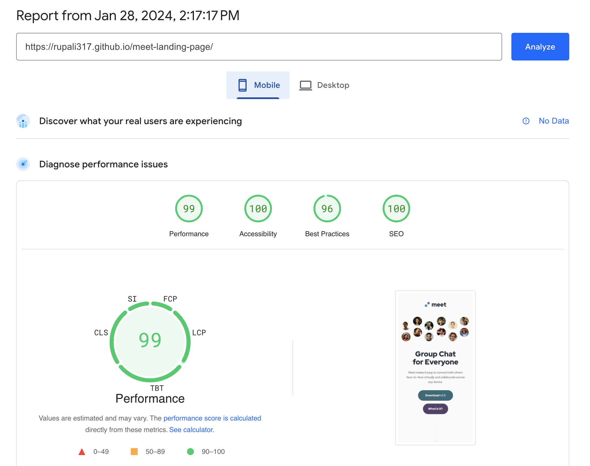
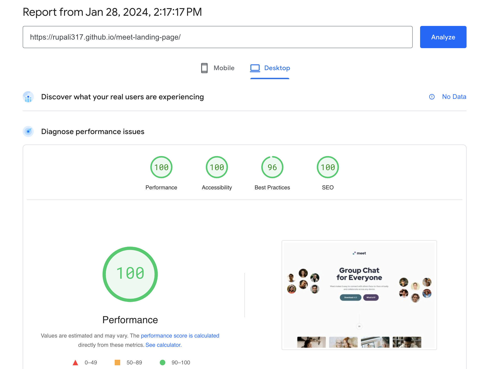

# Frontend Mentor - Meet landing page solution

This is a solution to the [Meet landing page challenge on Frontend Mentor](https://www.frontendmentor.io/challenges/meet-landing-page-rbTDS6OUR). Frontend Mentor challenges help you improve your coding skills by building realistic projects.

## Table of contents

- [Overview](#overview)
  - [The challenge](#the-challenge)
  - [Screenshots](#screenshots)
  - [PageSpeed Insights results](#pagespeed-insights-results)
  - [Links](#links)
- [My process](#my-process)
  - [Built with](#built-with)
  - [Tested with](#tested-with)
  - [What I learned](#what-i-learned)
  - [Continued development](#continued-development)
  - [Useful resources](#useful-resources)
- [Author](#author)
- [Acknowledgments](#acknowledgments)

## Overview

### The challenge

Users should be able to:

- View the optimal layout for the section depending on their device's screen size

### Screenshots

#### 1. Desktop


#### 2. Tablet


#### 3. Mobile


### PageSpeed Insights results

[Mobile version](https://pagespeed.web.dev/analysis/https-rupali317-github-io-meet-landing-page/deiesa044r?form_factor=mobile)



[Desktop version](https://pagespeed.web.dev/analysis/https-rupali317-github-io-meet-landing-page/deiesa044r?form_factor=desktop)



### Links

- Solution URL: [Meet landing page github](https://github.com/rupali317/meet-landing-page)
- Live Site URL: [Meet landing page challenge live](https://rupali317.github.io/meet-landing-page/)

## My process

### Built with

- Semantic HTML5 markup
- CSS custom properties
- Flexbox
- CSS Grid
- Mobile-first workflow

### Tested with

- Browsers used for testing: Google Chrome, Firefox, Safari, Brave, Microsoft Edge
- Devices:
  - (Real) MacBook Pro (15 inch), Samsung Galaxy A33 5G, Samsung Galaxy S20+, iPad Air 2
  - (Virtual) The mobile and tablet devices mentioned under Chrome's dev console

### What I learned

- If there are two `<source>` with the same definition of media-query, `<picture>` element will load only one

```html
<picture>
  <source
    srcset="./assets/desktop/image-hero-left.png"
    media="(min-width:80rem)"
  />
  <source
    srcset="./assets/desktop/image-hero-right.png"
    media="(min-width:80rem)"
  />
  
</picture>
```

- Browsers like Safari handles the rendering of the `<picture>` element differently than other browsers. Therefore the following CSS definition of `.footer-background picture` worked in other browsers except Safari:

```html
<div class="footer-background">
  <picture>
    <source
      srcset="./assets/images/desktop/image-footer.jpg"
      media="(min-width: 80rem)"
    />
    <source
      srcset="./assets/images/tablet/image-footer.jpg"
      media="(min-width: 48rem)"
    />
    
  </picture>
</div>
```

```css
.footer-background {
  height: 26.75rem;
  width: 100%;
  position: absolute;
  bottom: 0;
  z-index: -1;
  background-color: hsl(192, 37%, 48%);
}

.footer-background picture {
  mix-blend-mode: soft-light;
  opacity: 0.5;
}
```

In order to make it work for all browsers, this was the fix:

```css
.footer-background img {
  mix-blend-mode: soft-light;
  opacity: 0.5;
}
```

### Continued development

- Investigate the aspect ratio issue. The image at the footer is displaying incorrect aspect ratio

### Useful resources

- []() TBD

## Author

- Website - [Rupali Roy Choudhury](https://www.linkedin.com/in/rupali-rc/)
- Frontend Mentor - [@rupali317](https://www.frontendmentor.io/profile/rupali317)

## Acknowledgments

- I express my gratitude towards my mentor - Deborah for the insightful code review session.
